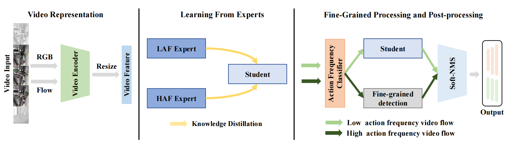

# AFAN

<!-- TOC -->

- [AFAN description](#model-description)
- [Model Architecture](#model-architecture)
- [Dataset](#dataset)
- [Requirements](#requirements)
- [Training process](#training-process)
- [Evaluation process](#evaluation-process)


<!-- /TOC -->

# AFAN description
An effective framework by adapting to the variability of action frequency, namely Action Frequency Adaptive Network (AFAN), which can be flexibly built upon any temporal action proposal generation method. AFAN consists of two modules: Learning From Experts (LFE) and Fine-Grained Processing (FGP). The LFE first trains a series of action proposal generators on different subsets of imbalanced data as experts and then teaches a unified student model via knowledge distillation. To better detect short actions, FGP first finds out high-action-frequency videos and then performs fine-grained detection. Extensive experimental results on four benchmark datasets (ActivityNet-1.3, HACS, THUMOS14 and FineAction) demonstrate the effectiveness and generalizability of the proposed AFAN, especially for high-action-frequency videos.


[Y. Tang, W. Wang, C. Zhang, J. Liu and Y. Zhao, "Temporal Action Proposal Generation With Action Frequency Adaptive Network," in IEEE Transactions on Multimedia, doi: 10.1109/TMM.2023.3295090.](https://ieeexplore.ieee.org/abstract/document/10183357)

# Model Architecture



# Dataset

Dataset used：[ActivityNet1.3](http://activity-net.org/download.html)

- Dataset consists of:

    - 200 activity classes

    - 10,024 training videos (15,410 instances)

    - 4,926 validation videos (7,654 instances)

    - 5,044 testing videos (labels withheld)

**Note:** We support experiments with publicly available dataset ActivityNet 1.3 for temporal action proposal generation now. To download this dataset, please use official ActivityNet downloader to download videos from the YouTube. Please refer this repo [TSN-yjxiong](https://github.com/yjxiong/temporal-segment-networks) to extract frames and optical flow.

For convenience, you can download the TSN features from [here (Paddle-Paddle storage)](<https://paddlemodels.bj.bcebos.com/video_detection/bmn_feat.tar.gz>).


To train AFAN we need three parts of data:

- Video annotations 1st form - [link](<https://paddlemodels.bj.bcebos.com/video_detection/activitynet_1.3_annotations.json>) - download and extract to the same folder

- Vidaeo annotations 2nd form - [link](<https://github.com/wzmsltw/BSN-boundary-sensitive-network.pytorch/blob/master/Evaluation/data/activity_net_1_3_new.json>) - download and place to the same folder

- Vidaeo annotations 3nd form - [link](<https://github.com/JJBOY/AFAN-Boundary-Matching-Network/tree/master/data/activitynet_annotations>) - download and place to the same folder

- Finally directory structure should be as follows:

  ```text
  <datasets dir>
  ├── ActivityNet1.3
  │   ├── annotations
  │   │   ├── activitynet_1.3_annotations.json
  │   │   ├── activity_net_1_3_new.json
  │   │   ├── anet_anno_action.json
  │   │   ├── video_info_action.csv
  │   ├── fix_feat_100
  │   │   ├── v_---9CpRcKoU.npy
  │   │   ├── v_---9CpRcKoU.npy
  │   │   ├── v_---9CpRcKoU.npy
  │   │   ├── v_---9CpRcKoU.npy
  │   │    ...
  ......
  ```

# Requirements

- Hardware
    - Use NVIDIA GPU to build the hardware environment.
    - **At least 24 GB device memory required**
- Framework
    - [MindSpore](https://www.mindspore.cn/install/en)
- For more information, see the following resources:
    - [MindSpore Tutorials](https://www.mindspore.cn/tutorials/en/master/index.html)
    - [MindSpore Python API](https://www.mindspore.cn/docs/api/en/master/index.html)
- 3d-part requirements specified in the `requirements.txt` file

## Evaluation process

### Evaluation

The model can be download [here](https://pan.baidu.com/s/1stlk1LtodB7Nt06GTslqiA) (zvs7).
```bash
bash run_eval.sh ./chekpoints/AFAN_student.ckpt
```

## Training process

### Training

**Before start you should set up `output_dir` and `data_root` in config.py.**


```bash
#train Expert1
cd ./BMN_expert1/scripts
bash run_train.sh CONFIG_PATH
```

```bash
#train Expert2
cd ./BMN_expert2/scripts
bash run_train.sh CONFIG_PATH
```

```bash
#train AN_classifier
cd ./AN_classifier/scripts
bash run_train.sh CONFIG_PATH
```

```bash
#train AFAN
cd ./scripts
bash run_train.sh CONFIG_PATH
```

### Reference
This implementation largely borrows from BMN.

code: [BMN](https://github.com/mindspore-ai/models/tree/eab643f51336dbf7d711f02d27e6516e5affee59/research/cv/BMN)

paper: BMN: Boundary-Matching Network for Temporal Action Proposal Generation