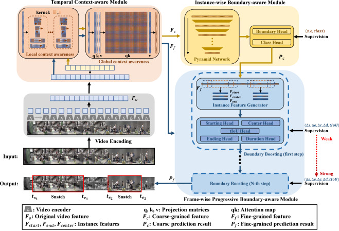

# PBBNet

<!-- TOC -->

- [PBBNet description](#model-description)
- [Model Architecture](#model-architecture)
- [Dataset](#dataset)
- [Requirements](#requirements)
- [Training process](#training-process)
- [Evaluation process](#evaluation-process)


<!-- /TOC -->

# PBBNet description
A novel Progressive Boundary-aware Boosting Network (PBBNet) is proposed for anchor-free temporal action localization. The PBBNet consists of three main modules: Temporal Context-aware Module (TCM), Instance-wise Boundary-aware Module (IBM), and Frame-wise Progressive Boundary-aware Module (FPBM). The TCM aggregates the temporal context information and provides features for the IBM and the FPBM. The IBM generates multi-scale video features to predict action results coarsely. Compared with IBM, the FPBM focuses on instance features corresponding to action predictions and uses more supervision information for boundary regression. Given action results from IBM, the FPBM uses a progressive boosting strategy to refine the boundary predictions multiple times with supervision from weak to strong. Extensive experiments on three benchmark datasets THUMOS14, ActivityNet-v1.3 and HACS show our PPBNet outperforms all existing anchor-free methods. 

[Tang, Y., Wang, W., Yang, Y., Zhang, C., & Liu, J. (2023). Anchor-free temporal action localization via Progressive Boundary-aware Boosting. Information Processing & Management, 60(1), 103141.](https://www.sciencedirect.com/science/article/pii/S0306457322002424)

# Model Architecture



# Dataset

Dataset used：[ActivityNet1.3](http://activity-net.org/download.html)

- Dataset consists of:

    - 200 activity classes

    - 10,024 training videos (15,410 instances)

    - 4,926 validation videos (7,654 instances)

    - 5,044 testing videos (labels withheld)

**Note:** We support experiments with publicly available dataset ActivityNet 1.3 for temporal action proposal generation now. To download this dataset, please use official ActivityNet downloader to download videos from the YouTube. Please refer this repo [TSP](https://github.com/HumamAlwassel/TSP) to extract frames and optical flow.

For convenience, you can download the TSP features from [here](https://pan.baidu.com/s/1tw5W8B5YqDvfl-mrlWQvnQ?pwd=xuit).


To train PBBNet we need to download data from [here](https://pan.baidu.com/s/1vvXdIYSsbXIaolpgxafTxQ?pwd=wlwg):

- Finally directory structure should be as follows:

  ```text
  data
  ├── ActivityNet1.3
  │   ├── annotations
  │   │   ├── cuhk_val_simp_share.json
  │   │   ├── anet1.3_tsp_filtered.json
  │   ├── coarse_proposals_train
  │   │   ├── v_---9CpRcKoU.csv
  │   │   ├── v_---9CpRcKoU.csv
  │   │    ...
  │   ├── coarse_proposals_val
  │   │   ├── v__1vYKA7mNLI.csv
  │   │   ├── v__1vYKA7mNLI.csv
  │   │    ...
  │   ├── tsp_features
  │   │   ├── v_---9CpRcKoU.npy
  │   │   ├── v__1vYKA7mNLI.npy
  │   │    ...
  ......
  ```

# Requirements

- Hardware
    - Use NVIDIA GPU to build the hardware environment.
    - **At least 24 GB device memory required**
- Framework
    - [MindSpore](https://www.mindspore.cn/install/en)
- For more information, see the following resources:
    - [MindSpore Tutorials](https://www.mindspore.cn/tutorials/en/master/index.html)
    - [MindSpore Python API](https://www.mindspore.cn/docs/api/en/master/index.html)
- 3d-part requirements specified in the `requirements.txt` file

## Evaluation process

### Evaluation

The model can be download [here](https://pan.baidu.com/s/1vvXdIYSsbXIaolpgxafTxQ?pwd=wlwg) (wlwg).
```bash
cd ./scripts
bash run_eval.sh ./chekpoints/pbbnet_best.ckpt
```

## Training process

### Training

**Before start you should set up `output_dir` and `data_root` in config.py.**


```bash
#train PBBNet
cd ./scripts
bash run_train.sh CONFIG_PATH
```

### Reference
This implementation largely borrows from BMN.

code: [BMN](https://github.com/mindspore-ai/models/tree/eab643f51336dbf7d711f02d27e6516e5affee59/research/cv/BMN)

paper: BMN: Boundary-Matching Network for Temporal Action Proposal Generation