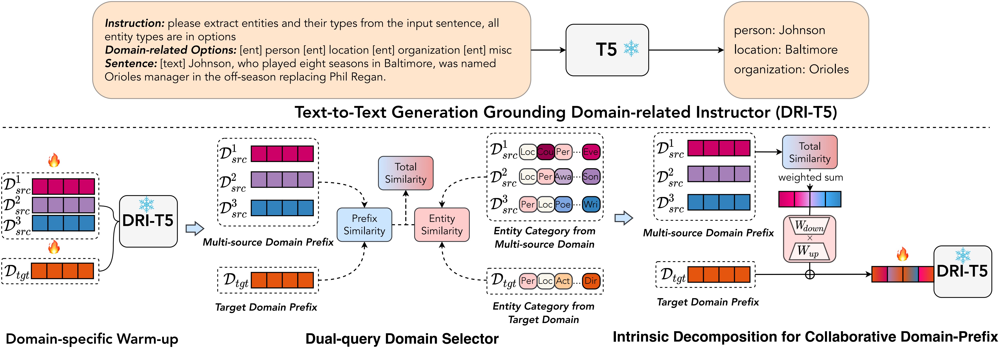

# 目录

- [CP-NER概述](#CP-NER概述)
- [模型架构](#模型架构)
- [数据集](#数据集)
- [环境要求](#环境要求)
- [快速入门](#快速入门)
- [脚本说明](#脚本说明)
    - [脚本及样例代码](#脚本及样例代码)
    - [脚本参数](#脚本参数)
        - [CoNLL2023](#CoNLL2023)
- [训练过程](#训练过程)
    - [训练](#训练)
- [评估和推理过程](#评估和推理过程)
- [ModelZoo主页](#ModelZoo主页)
- [引用](#引用)

# CP-NER概述

命名实体识别(NER)是知识图谱和自然语言处理领域的重要任务。现实场景中由于数据稀缺的原因，要获取大量的domain相关的标注数据通常消耗巨大。另一方面，想要在资源丰富的domain数据(source)上训练模型，并将知识迁移到新的特定的domain数据(target)上，通常面临语义鸿沟以及target domain数据量受限的问题。要解决上述问题，跨域命名实体识别(Cross-domain NER)任务应运而生。原作者提出了CP-NER模型，将NER重新定义为基于domain相关的text-to-text生成，并提出domain-prefix协同调优将知识适应于cross-domain NER任务在CrossNER benchmark上的单一source domain迁移到target domain设定下取得了SOTA。

论文：[One Model for All Domains: Collaborative Domain-Prefix Tuning for Cross-Domain NER](https://arxiv.org/pdf/2301.10410.pdf)

# 模型架构

本文将cross-domain NER处理为sequence-to-sequence生成式任务，并使用了固定参数的T5模型，并提出了domain-prefix的协同优化方法，主要包含一下三个步骤：

1. domain-specific warm-up从各个domain的语料中捕获知识；
2. dual-query domain selector从多个source domain确定不同prefix知识的比重；
3. intrinsic decomposition for collaborative domain-prefix灵活地融合source和target domain的prefix中的知识。



# 数据集

- 先使用以下代码下载处理好的数据：

```bash
wget 120.27.214.45/Data/ner/cross/data.tar.gz
tar -xzvf data.tar.gz
```

解压后数据会存放到data文件夹中，包括了 CoNLL-2003, MIT-movie, MIT-restaurant, Ai, Literature, Music, Politics和science等数据.

- 每个数据集都遵循以下的数据格式：

    - train.json：训练数据
    - val.json ：验证数据
    - test.json：测试数据
    - entity.schema：实体类别
    - event.schema
    - record.schema
    - relation.schema

# 环境要求

- 硬件（Ascend处理器）
    - 准备Ascend/GPU/CPU处理器搭建硬件环境。
- 框架
    - [MindSpore](https://gitee.com/mindspore/mindspore)
- 更多关于Mindspore的信息，请查看以下资源：
    - [MindSpore教程](https://www.mindspore.cn/tutorials/zh-CN/master/index.html)
    - [MindSpore Python API](https://www.mindspore.cn/docs/zh-CN/master/api_python/mindspore.html)

# 快速入门

通过官方网站安装MindSpore和下载数据集后，您可以按照如下步骤进行训练和评估：

- Ascend/GPU/CPU处理器环境运行

```shell
# 运行训练示例
python ms_main.py
```

# 运行推理示例

```shell
# 将yaml文件中do_eval设置为True
python ms_main.py
```

- device should be in ["Ascend","GPU","CPU"].

# 脚本说明

## 脚本及样例代码

```text
CP-NER
    │── README.md   # CP-NER相关声明
    │── conf
    │   │──hydra        # 详细的训练配置文件
    │   │──config.yaml # hydra配置文件
    │── logs  # 输出文件和输出日志
    │── src
    │   │──extraction # 抽取策略相关文件
    │   │──sel2record # 序列和记录的转换文件
    │   │──seq2seq   # 包含模型文件、数据处理和配置文件
    │   │──utils.py  # 设置学习函数
    │── dataset.py   # 训练脚本
    │── ms_main.py   # 评估脚本
```

## 脚本参数

在`conf`文件夹中可以同时配置参数

### CoNLL2023

```text
train_file: 'data/conll03/train.json'
validation_file: 'data/conll03/val.json'
test_file: 'data/conll03/test.json'
record_schema: '../../data/conll03/record.schema'
output_dir: 'output/conll03-t5-base'        # 模型和训练数据的输出路径
logging_dir: 'output/conll03-t5-base_log'   # 训练日志的路径
model_name_or_path: '../../hf_models/t5-base' # 预训练模型的路径
```

训练过程中产生的最佳模型权重、训练细节和测试结果会存储到`logs/xxx/output/conll03-t5-base`.

其他数据集及更多配置细节请参考 `conf/hydra/`。

# 训练过程

## 训练

- GPU处理器环境或Ascend处理器运行

```bash
# 修改yaml文件中device为'GPU'或'Ascend'
python ms_main.py
```

训练过程日志和输出会存储在`logs`路径下

# 评估和推理过程

**推理前需参照 [MindSpore C++推理部署指南](https://gitee.com/mindspore/models/blob/master/utils/cpp_infer/README_CN.md) 进行环境变量设置。**

- GPU处理器环境或Ascend处理器运行

```bash
# 将yaml文件中do_predict设为True，并配置output_dir路径
python ms_main.py
```

预测输出将存储在`output_dir`路径下

# ModelZoo主页

请浏览官网[主页](https://gitee.com/mindspore/models)。

# 引用
如果您使用了上述代码，请您引用下列论文:
```text
@article{DBLP:journals/corr/abs-2301-10410,
  author    = {Xiang Chen and
               Lei Li and
               Shuofei Qiao and
               Ningyu Zhang and
               Chuanqi Tan and
               Yong Jiang and
               Fei Huang and
               Huajun Chen},
  title     = {One Model for All Domains: Collaborative Domain-Prefix Tuning for
               Cross-Domain {NER}},
  journal   = {CoRR},
  volume    = {abs/2301.10410},
  year      = {2023},
  url       = {https://doi.org/10.48550/arXiv.2301.10410},
  doi       = {10.48550/arXiv.2301.10410},
  eprinttype = {arXiv},
  eprint    = {2301.10410},
  timestamp = {Mon, 13 Mar 2023 11:20:37 +0100},
  biburl    = {https://dblp.org/rec/journals/corr/abs-2301-10410.bib},
  bibsource = {dblp computer science bibliography, https://dblp.org}
}
```